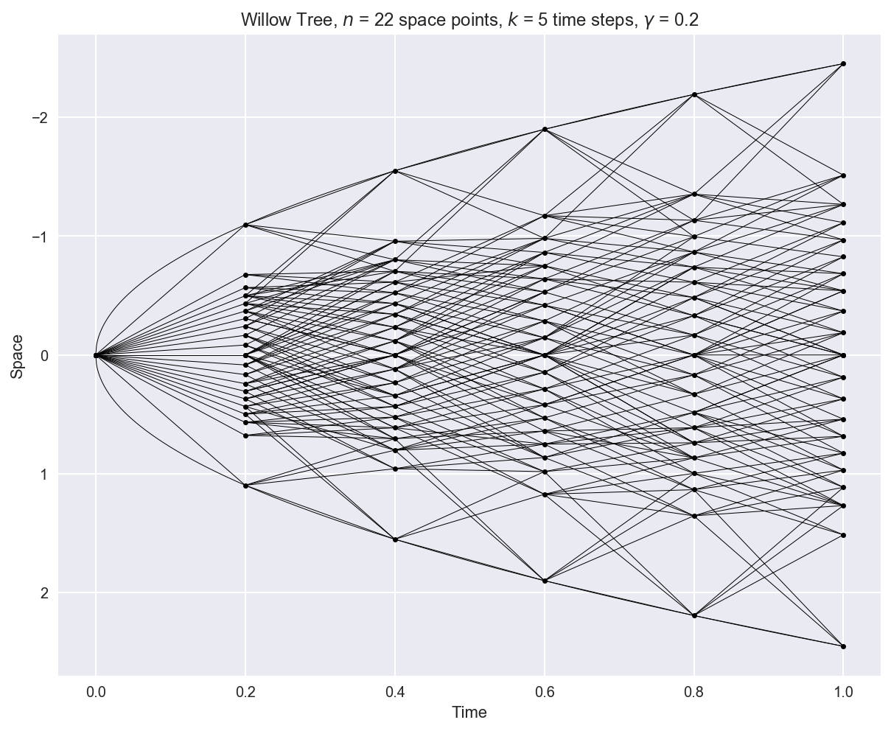
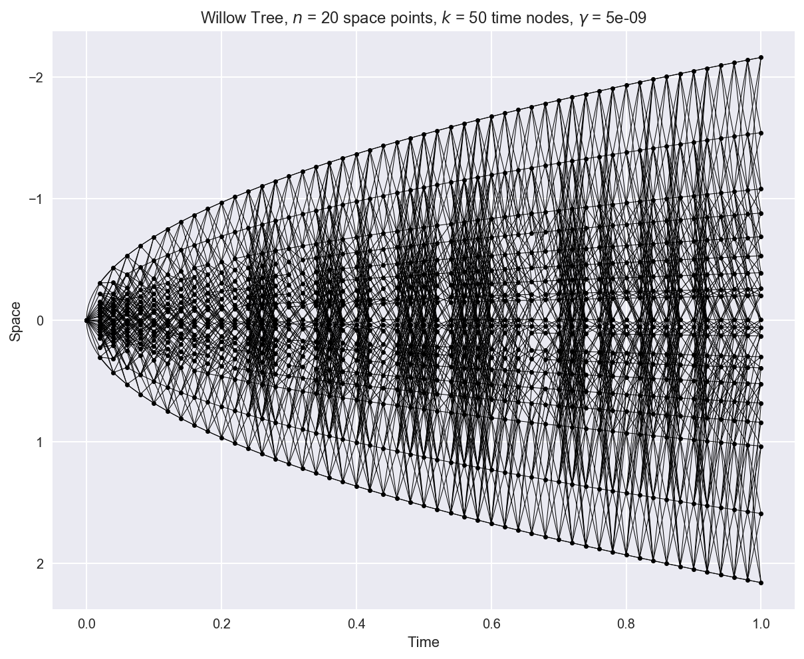

# Willow Tree
`willowtree` is an open source Python implementation of Michael Curran's derivatives pricing model of the same name.

Curran, M. (2001): _[Willow Power: Optimizing Derivative Pricing Trees](https://papers.ssrn.com/sol3/papers.cfm?abstract_id=1590288)_



## What is the Willow Tree?
The willow tree is a highly efficient, recombining lattice designed for fast and accurate pricing of derivative contracts. It models the standard Brownian motion directly, by means of a discrete time Markov chain, and the resulting estimate can serve as the basis for more complex processes, such as the geometric Brownian motion.

The lattice has two distinctive features:

- __it expands as the square root of time__, in accordance with the Brownian motion and unlike the binomial model, which grows linearly in time. It opens quite fast at the beginning, covering a high-probability region neglected by standard trees, and slowly later on, being constrained within a set confidence region of the normal marginal distribution. This aspect both prevents the waste of time and computational resources on the tails of the distribution, areas with little impact on the definition of the current price of the security, and avoids the arbitrary practice of pruning the tree, namely, disregarding branches, along with their offsprings, located in low probability regions;


- __it has a constant number of nodes per time step__. With time, this number grows linearly, and not quadratically, as it does in the binomial model.


These features increase the efficiency of the lattice, because they force the paths to travel across a smaller structure squeezed in the body of the desired density, and allow for a fast convergence to the true, unknown price distribution.

## Main Features
Being a proxy for the standard Brownian motion, `willowtree` can:
- help price a wide array of European and American derivative contracts;
- be considerably faster than other lattices, such as the binomial and trinomial, especially in higher dimensions: once a set of transition matrices is generated, it can be stored and becomes available for future use;
- serve as building block for more complex processes (e.g. the geometric Brownian motion) and models (e.g. GARCH conditional volatility), of particular relevance in finance, engineering, and physics.

## Documentation
A detailed history of the model, as well as the mathematical theory behind it, are available in the [companion handbook]().

## Dependencies
`willowtree` requires Python 3.5+, and is built on top of the following modules:
- **NumPy**: v. 1.13+
- **SciPy**: v. 0.19+
- **Matplotlib**: v. 2.0+
- **Seaborn**: v. 0.8+

## Installation
The source code is currently hosted on GitHub at: https://github.com/federicomariamassari/willow-tree.
Either clone or download the git repository. To clone the repository, on either Terminal (macOS) or Command Prompt (Windows) enter the folder inside which you want the repository to be, possibly changing directory with `cd <desired path>`, and execute:
```shell
$ git clone https://github.com/federicomariamassari/willow-tree.git
```
When the process is over, navigate through folder `willow-tree` using `cd willow-tree` and run:
```shell
$ python3 setup.py install
```
or, if only Python 3 is present on your system, simply:
```shell
$ python setup.py install
```
Then, within a Python environment, e.g. IDLE or Jupyter Notebook, execute:
```python
import willowtree
```
or use `wt` as alias:
```python
import willowtree as wt
```
Finally, call any of its modules, e.g. `sampling`, as either: `willowtree.sampling` or `wt.sampling` based on the previous choice.

To check which version of `willowtree` is actually installed, use `willowtree.__version__`.

## License
`willowtree` is offered under the MIT License.

## Contributing
`willowtree` is a small but continuously evolving project open to anyone willing to contribute—simply fork the repository and modify its content. Any improvements, especially in making the code more readable (or _Pythonic_) or faster is more than welcome. For git commits, it is desirable to follow [Udacity's Git Commit Message Style Guide](https://udacity.github.io/git-styleguide/).

Feel free to bookmark, or "star", the repository if you find this project interesting!

## Future Directions
Presently, `willowtree` only handles one-dimensional lattices, implemented according to [Xu, Hong, and Qin's methodology](https://www.researchgate.net/publication/263268910_A_new_sampling_strategy_willow_tree_method_with_application_to_path-dependent_option_pricing). Future versions will try to focus on:

- presenting more algorithms to build the tree (e.g. [Haussmann and Yan](http://citeseerx.ist.psu.edu/viewdoc/download?doi=10.1.1.136.7988&rep=rep1&type=pdf), 2004);
- accounting for multi-dimensionality.

## Latest Updates

_October 28, 2017_

Following commit `3531721`, `willowtree` is now a package which can be installed from `setup.py`.

_October 24, 2017_

Following commit `ab317d5` the willow tree has become a very precise and robust algorithm. It returns well-behaved Markov chains by generating accurate transition matrices and, if this is not possible, by either replacing wrong ones with interpolated versions (giving rise to the characteristic _black patches_, as in the figure below) or shortening the chain as appropriate.



Why the black patches? Adjacent, well-defined transition matrices have positive probabilities in different cells. When these matrices are used to interpolate one in between, the resulting object is less sparse, with a larger number of paths drawn.

## Known Issues
- _Inability to choose gamma = 0, with gamma in [0, 1], as parameter value in the model._ Commit `f014907` partially fixes the issue by increasing gamma by steps of 1e-9 (first two seconds of runtime), 1e-6 (additional 8 seconds), and 1e-2 until the optimisation is successful. This method ensures that a solution is found with a value of gamma as close as possible to the one supplied by the user, and in a reasonable amount of time.

- _Significant slowness for n > 20._ The bottleneck is the linear programming algorithm: each iteration (for a particular tolerance level) may take a very long time, and cannot be stopped unless the optimizer is run in a separate process, using Python's `multiprocessing` module. This may not be a problem if the matrices are to be stored and used at a later time, but it is nevertheless something that should be dealt with.

For a list of all open and closed issues, please visit the [issue section](https://github.com/federicomariamassari/willow-tree/issues?utf8=✓&q=).
